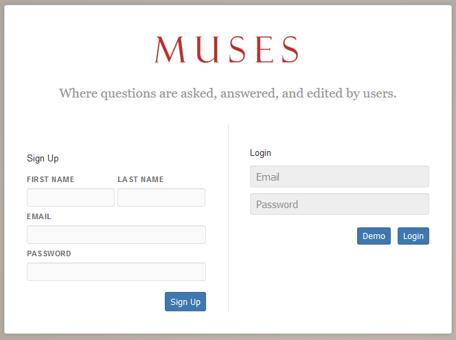
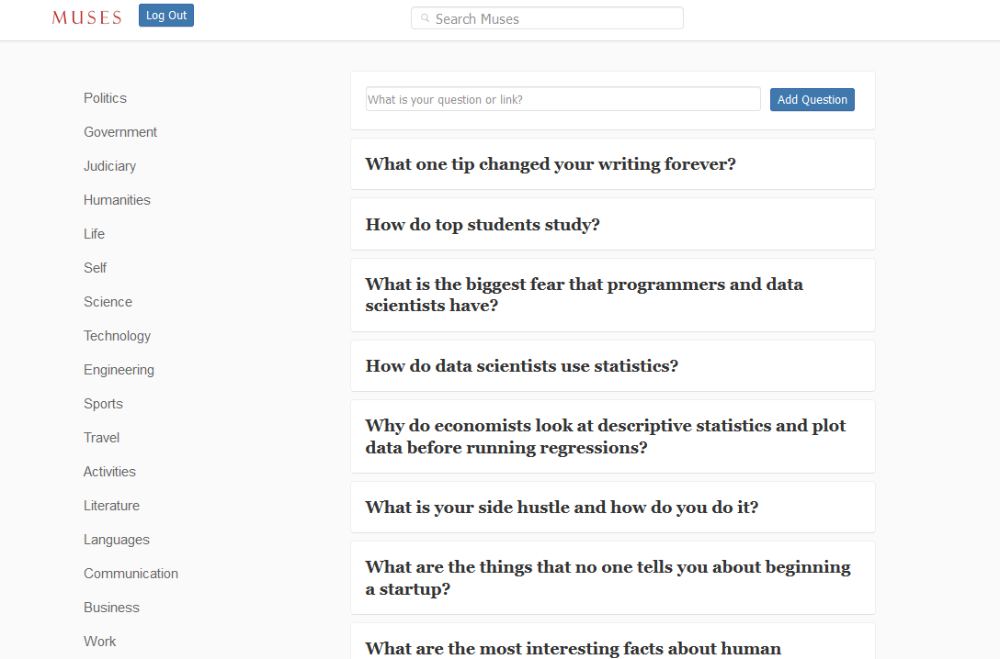
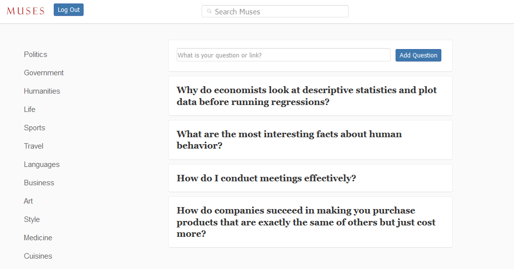
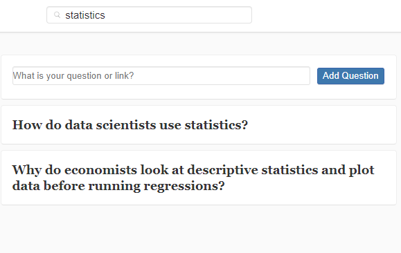
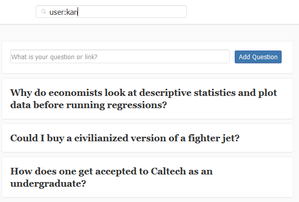
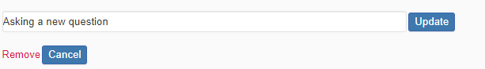
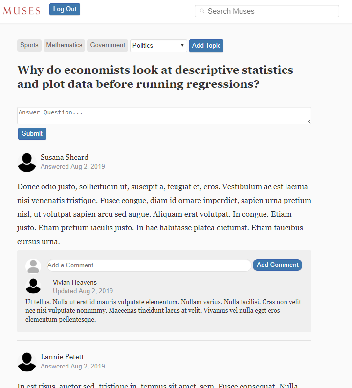

# Muses

A Quora clone where questions are asked, answered, and edited by users.

[Live Site][6]

### Features:

+ Auth account creation, guest access
+ Logged in user:
    + has (CRUD) access to Questions
    + Create an answer to a question
    + Add a comment to an answer
    + Navigate questions by topics
    + Update topics to any question
    + Search:
        + regular input will search by question
        + `field:value` will search questions by:
            + `user:kari`
            + `topic:art`
            + `question:flying` 

## Technology

### Backend

+ Postgresql
+ Rails 5
+ Active Records
+ BCrypt
+ jbuilder

### Frontend

+ Nodejs
+ React
+ Redux
+ jQuery

## Project Design

### Wiki

+ [Backend Routes and API][1]
+ [Frontend Routes][2]
+ [Basic Features][3]
+ [Sample State][4]
+ [Schema][5]

[1]: https://github.com/VladRez/muses/wiki/backend-routes
[2]: https://github.com/VladRez/muses/wiki/frontend-routes
[3]: https://github.com/VladRez/muses/wiki/MVP-list
[4]: https://github.com/VladRez/muses/wiki/sample-state
[5]: https://github.com/VladRez/muses/wiki/schema
[6]: https://muses.herokuapp.com


### Implementation

#### User Account Authentification

Passwords are secured using the `BCrypt` gem to generate a *password digest*. 
A user's login session is tracked by a generated *session token* stored in the database and on the client-side as a browser cookie.

```ruby
def self.find_by_credentials(email, password)
        user = User.find_by(email: email)
        user && user.is_password?(password) ? user : nil
    end

    def password=(password)
        @password = password
        self.password_digest = BCrypt::Password.create(password)
    end

    def is_password?(password)
        BCrypt::Password.new(self.password_digest).is_password?(password)
    end

    def reset_session_token!
        self.session_token = new_session_token
        self.save!
        self.session_token
    end
```



#### Main Question Feed

On user login a `GET` request is made to a backend api. 

The api response will be a consolidated json object. This shape will be used consitently throughout the application to maintain reliable redux store access. 

```js
entities:
    answers:
        469: {id: 469, answer_body: "Answering this question", answer_author_id: 390, created_at: "2019-08-09T17:54:25Z"}
    comments:
        325: {id: 325, answer_id: 469, comment_body: "Commenting on an answer", comment_author_id: 390, created_at: "2019-08-09T17:54:37Z"}
    questions:
        302: {id: 302, question: "Asking a new question", question_author_id: 390, topics: Array(0), created_at: "2019-08-09T17:54:10Z"}
    topics:
        42: {id: 42, name: "Judiciary"}
        43: {id: 43, name: "Humanities"}
    ///.....
    users:
        390: {id: 390, first_name: "Kari", last_name: "Kit"}
```




#### Filter Question feed by Topic


A right side panel contains a list of topics which directly corrispond to the topics defined in a question's `topics` property. 
Clicking a topic will update the question feed.



#### Question Search

Typing in the search bar will make a `GET` request with the following params:

```js
query = {
    field: 'question',
    value: 'data science'
}
///ajax request

 $.ajax({
    method: "GET",
    url: `/api/questions?${query ? $.param(query) : ""}`
  });
```




### Filter Search

Make a filtered search using a `:` .

```js
query = {
    field: 'question',
    value: 'data science'
}
//
query = {
    field: 'user',
    value: 'kari'
}
//
query = {
    field: 'topic',
    value: 'Cooking'
}
```



### Question Page

Since the redux store is consistent thorught the application multiple reducers share the same action.



This means when a user views, answers questions, or comments on an answer the redux store is already updated with the latest data.




## Future Planned features

General:

+ Replace input forms components in favor of modals input forms to allow more dynamic user options without crowding up the webpage. 

Question Pages:

+ Replies to a comment.
+ Upvotes
+ Markdown and Media content for answers.
+ User profiles


